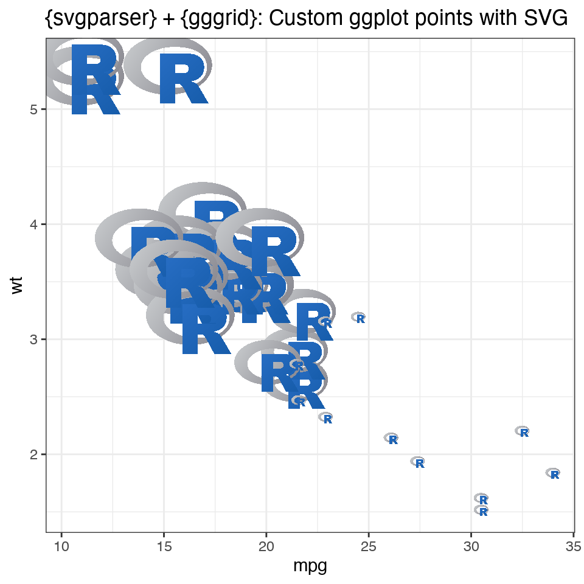
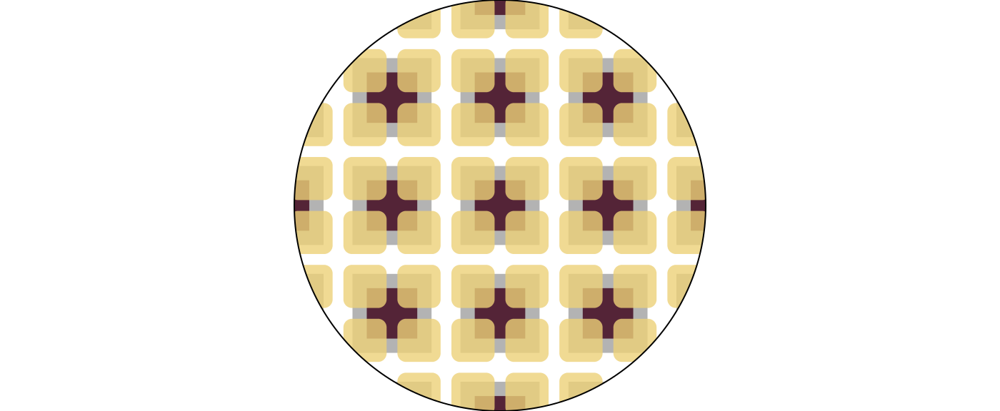
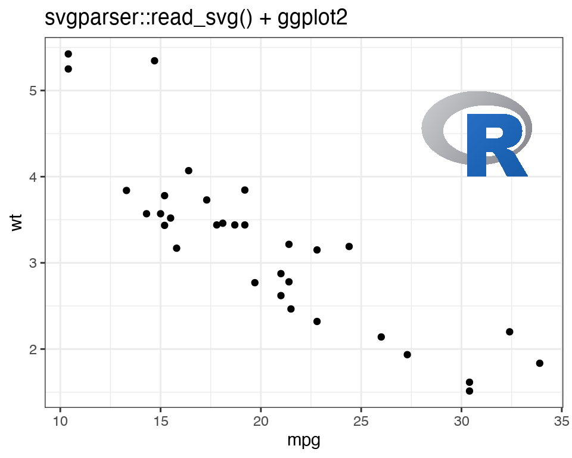
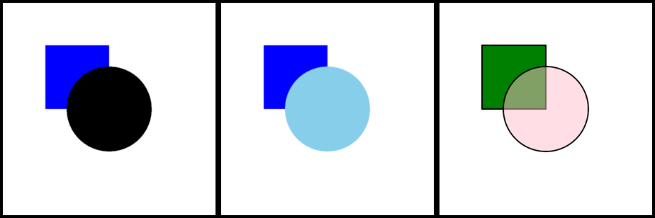

<!-- README.md is generated from README.Rmd. Please edit that file -->

```{r, include = FALSE}
knitr::opts_chunk$set(
  collapse = FALSE,
  comment = "#>",
  fig.path = "man/figures/README-",
  out.width = "100%"
)


library(svgparser)
library(ggplot2)
library(gggrid)
library(dplyr)
library(knitr)
library(kableExtra)

#~~~~~~~~~~~~~~~~~~~~~~~~~~~~~~~~~~~~~~~~~~~~~~~~~~~~~~~~~~~~~~~~~~~~~~~~~~~~~
# Ensure that images are rendered using a device which understands patterns
#~~~~~~~~~~~~~~~~~~~~~~~~~~~~~~~~~~~~~~~~~~~~~~~~~~~~~~~~~~~~~~~~~~~~~~~~~~~~~
knitr::opts_chunk$set(dev.args = list(png = list(type = "cairo")))
```


```{r pkgdown, eval=FALSE, include=FALSE}
pkgdown::build_site(override = list(destination = "../coolbutuseless.github.io/package/svgparser"))
```


```{r feature_tables, echo = FALSE, message = FALSE}
svg_features <- readr::read_csv(
"Feature, Support, Notes
<path> elements    ,  yes, Working well! 
<rect> <circle> etc,  yes, Working 
<ellipse>          ,  yes, No rotation yet
<text>             ,  meh, Works at a basic level. Don't expect anything using fancy text effects to work
style cascading    ,  yes, Using `{cssparser}`
<linearGradient> <radialGradient>,  yes, converted to R4.1 gradient objects. 'userSpaceOnUse' coordinate space only. Send examples!
transform presentation attribute, yes, .
<defs> <use>  , yes, .
<pattern>     , no, Impossible?
<filter>      , no, Impossible?
animation     , no, Impossible?
linetypes     , no, Planned feature - but R is much more limited compared to SVGs linetype features.
masks         , no, need example SVG
clipping paths, yes, works on the few examples tested
", show_col_types = FALSE, lazy = FALSE)
```


# svgparser 

#### Load SVG files as R vector objects (grobs) or data.frames

<!-- badges: start -->

[](https://github.com/coolbutuseless/svgparser-dev/actions)
<!-- badges: end -->

`svgparser` loads vector-based **SVG** images as R vector objects.

The vector objects which are created in R are the standard graphics object ('grob')
in the base R `{grid}` graphics system.

SVG images can also be imported as data.frames.  Each shape, line and point is
represented in the data.frame with copious helpings of metadata to relate 
individual coordinates to the original SVG structure.


## Example: Load SVG as vector image

This example loads an SVG image into a base R `grid` graphics object, and 
then draws the object using `grid.draw`.

Note that this is not a fixed size raster image!  This is a vector image 
which can be resized without loss of precision.

```{r opener1, fig.height = 6, out.width="50%"}
tiger_filename <- system.file("tiger.svg", package = "svgparser")
tiger_grob <- svgparser::read_svg(tiger_filename)
grid::grid.draw(tiger_grob)
```

## Example: Load SVG as a data.frame

This example loads an SVG as a data.frame and then plots the coordinates
using ggplot. The element type from the original SVG is used as the 
aesthetic for colouring the lines in the plot.

```{r opener2, fig.height = 6, out.width="60%", eval = TRUE, echo = TRUE}
tiger_df <- svgparser::read_svg(tiger_filename, obj_type = 'data.frame')

nrow(tiger_df)
knitr::kable(head(tiger_df, 3))
```

There's enough information in the data.frame to manually recreate most of the
SVG using whatever drawing mechanism you'd like.   Here, I've used `ggplot2` to
draw the outlines from the data.

```{r opener2b, fig.height = 6, out.width="60%", eval = FALSE, echo = TRUE}
ggplot(tiger_df) + 
  geom_path(aes(x, y, colour = name, group = interaction(elem_idx, path_idx))) +
  scale_y_reverse()
```

```{r opener3, fig.height = 6, out.width="60%", eval = TRUE, echo = FALSE}
# Taking artistic license to keep the example small, and doing more
# presentation work here.
tiger_df <- svgparser::read_svg(tiger_filename, obj_type = 'data.frame')
ggplot(tiger_df) + 
  geom_path(aes(x, y, colour = name, group = interaction(elem_idx, path_idx)), 
            alpha = 1, size = 0.25) + 
  coord_equal() + 
  theme_bw() + 
  theme(
    legend.position = c(0.02, 0.02),
    legend.justification = c(0, 0),
    legend.background = element_blank()
  ) + 
  scale_y_reverse() + 
  labs(title = "Manually drawing an SVG from its data.frame representation")
```


  
## What's in the box

* `read_svg()` read SVG into R as a `{grid}` graphics object (grob) or data.frame
* `load_supertinyicon()` to load an SVG icon from the 
  [Super Tiny Icons](https://github.com/edent/SuperTinyIcons) icon pack
  included with this package. See `LICENSE-supertinycons.txt` (MIT License)

        
## Installation

This package is available on [GitHub](https://github.com/coolbutuseless/svgparser).

``` r
# install.package('remotes')
remotes::install_github('coolbutuseless/cssparser') # Handles CSS styling
remotes::install_github('coolbutuseless/svgparser')
```

With **R > v4.1.0**:

* gradients and clipping paths are rendered as correctly as possible.

With  **R < v4.1.0**:

* solid colours will be used in place of gradients, and 
* any elements which use a clipping path in the SVG will not be properly clipped in R.


## Vignettes

| Description |    |
|-------------|----|
| [SVG in ggplot using gggrid](https://coolbutuseless.github.io/package/svgparser/articles/gggrid.html) | [](https://coolbutuseless.github.io/package/svgparser/articles/gggrid.html) |
| [Creating tileable patterns for R graphics](https://coolbutuseless.github.io/package/svgparser/articles/tileable.html) |  [](https://coolbutuseless.github.io/package/svgparser/articles/tileable.html) |
| [Add SVG to ggplot2 plots](https://coolbutuseless.github.io/package/svgparser/articles/ggplot2.html) |  [](https://coolbutuseless.github.io/package/svgparser/articles/ggplot2.html) |
| [Debugging Issues by Using False Colouring](https://coolbutuseless.github.io/package/svgparser/articles/false-colours.html) |  [](https://coolbutuseless.github.io/package/svgparser/articles/false-colours.html) |
| [Customising SVG with CSS](https://coolbutuseless.github.io/package/svgparser/articles/css.html) |  [](https://coolbutuseless.github.io/package/svgparser/articles/css.html) |


## SVG Feature Support

```{r features_svg, echo = FALSE}
svg_features %>%
  mutate(
    Support = cell_spec(Support, background = case_when(
      Support == 'yes'  ~ 'lightgreen',
      Support == 'meh' ~ 'lemonchiffon',
      Support == 'no'  ~ 'lightcoral'
    )),
    Feature = htmltools::htmlEscape(Feature),
    Notes   = htmltools::htmlEscape(Notes)
  ) %>%
  kable(caption  = "SVG Feature Support", escape = FALSE)
```


## SVG icon pack `SuperTinyIcons` is included with the package

[SuperTinyIcons](https://github.com/edent/SuperTinyIcons) 
is a set of icons focussed on small representations of logos of some internet companies 
and other images.

These icons can be accessed from this package using:

* `supertinyicons` (for the names of all the icons), and 
* `load_supertinyicon()` to load an icon as an R object. 

See `LICENSE-supertinycons.txt` for MIT license information for this icon set.

```{r icon1, echo = TRUE, eval = FALSE}
supertinyicon_names[1:10]
load_supertinyicon('twitter', obj_type = 'svg')
```


```{r icon2, echo = FALSE, evel = TRUE, comment = ""}
supertinyicon_names[1:10]
# Artistic license to skip over the details of how to get pretty svg output
cat(as.character(xml2::read_xml(load_supertinyicon('twitter', obj_type = 'svg'))))
```


```{r icon3, out.width = "30%", fig.height = 4, comment = " "}
grid.draw(load_supertinyicon('twitter'))
```
 
 
## Technical bits

`svgparser` is vanilla R code which walks the XML tree and converts elements (and nested sub-elements) into
a nested set of `grid::grobTree()` objects.

Circles, lines and points are translated to their corresponding `grid` object i.e.
`grid::circleGrob()`, `grid::linesGrob()`, `grid::pointsGrob()`.

Radial and linear gradients are captured as the new objects available in R4.1: `grid::radialGradient()` and 
`grid::linearGradient()`

For `<use>` tags, `{svgparser}` extracts *xpath* information to retrieve relevant referenced section of the
SVG, parse it into R objects and then insert it at the given location.

There are only a few dependencies:

* [`{xml2}`](https://cran.r-project.org/package=xml2) is used as to parse the SVG into R
* [`{cssparser}`](https://github.com/coolbutuseless/cssparser) is used to cascade stylesheets within the XML representation.  This
  was initially built-in to svgparser, but was moved to a separate package as 
  things got complicated.  (Who could have known that parsing and cascading style sheets
  could be so complicated!)
* [`{stringi}`](https://cran.r-project.org/package=stringi) is used as part of the lexer which breaks some of the SVG structures 
  into smaller objects for parsing e.g. transform strings like `translate(10, 10) rotate(50)`

    

## Related Software

* [{rsvg}](https://cran.r-project.org/package=rsvg) renders SVG files into bitmaps, and 
   some other file representations.
    * This package is wraps the C library [librsvg](https://github.com/GNOME/librsvg)
* [{grImport2}](https://cran.r-project.org/package=grImport2) reads SVG files into R
    * `grImport2` only seems to load SVG created by the Cairo graphics library

#### Comparison to related R packages

|                        | svgparser            | rsvg                                   | grImport2                           |
|------------------------|-----------           |----------------------------------------|-------------------------------------|
| Loads as Vector Object | Yes (grob)           | No (bitmap)                            | Yes (grob)                          |
| Loads as Standard Grob | Yes (grobTree)       | No (bitmap)                            | No (custom PictureGrob)             |
| Exposes coordinates    | Yes (as a data.frame) along with SVG meta-information | No                                     | Yes (via grid::grobPoints), but lacks meta-information |
| Note                   |                      | Backed by fast + well tested C library | Will only load SVG created by Cairo |
 
## Acknowledgements

* Thanks to early alpha testers:
    * [Trevor Davis](https://github.com/trevorld)
    * [timelyportfolio](https://github.com/timelyportfolio)
    * [Simon Coulombe](https://github.com/SimonCoulombe)
    * [Mitchell O'hara-Wild](https://github.com/mitchelloharawild)
    * [Maya Gans](https://github.com/MayaGans)
    * [Thomas Mock](https://github.com/jthomasmock)
    * [Jeroen Ooms](https://github.com/jeroen)
    * [Ijeamakaanyene](https://github.com/Ijeamakaanyene)
    * [Halian Vilela](https://github.com/halian-vilela)
    * [Dmytro Perepolkin](https://github.com/dmi3kno)
    * [arthurwelle](https://github.com/arthurwelle)
* R Core for developing and maintaining the language.
* CRAN maintainers, for patiently shepherding packages onto CRAN and maintaining
  the repository
