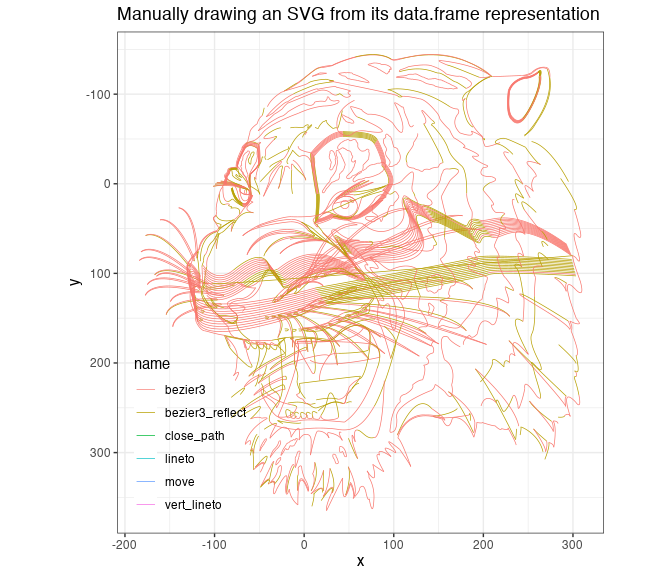

<!-- README.md is generated from README.Rmd. Please edit that file -->

# svgparser

#### Load SVG files as R vector objects (grobs) or data.frames

<!-- badges: start -->


[](https://github.com/coolbutuseless/svgparser/actions)
<!-- badges: end -->

`svgparser` loads vector-based **SVG** images as R vector objects.

The vector objects which are created in R are the standard graphics
object (‘grob’) in the base R `{grid}` graphics system.

SVG images can also be imported as data.frames. Each shape, line and
point is represented in the data.frame with copious helpings of metadata
to relate individual coordinates to the original SVG structure.

## Example: Load SVG as vector image

This example loads an SVG image into a base R `grid` graphics object,
and then draws the object using `grid.draw`.

Note that this is not a fixed size raster image! This is a vector image
which can be resized without loss of precision.

``` r
tiger_filename <- system.file("tiger.svg", package = "svgparser")
tiger_grob <- svgparser::read_svg(tiger_filename)
grid::grid.draw(tiger_grob)
```


## Example: Load SVG as a data.frame

This example loads an SVG as a data.frame and then plots the coordinates
using ggplot. The element type from the original SVG is used as the
aesthetic for colouring the lines in the plot.

``` r
tiger_df <- svgparser::read_svg(tiger_filename, obj_type = 'data.frame')

nrow(tiger_df)
```

    #> [1] 57117

``` r
knitr::kable(head(tiger_df, 3))
```

<table>
<thead>
<tr>
<th style="text-align:right;">
x
</th>
<th style="text-align:right;">
y
</th>
<th style="text-align:left;">
name
</th>
<th style="text-align:right;">
idx
</th>
<th style="text-align:right;">
path\_idx
</th>
<th style="text-align:right;">
inst\_idx
</th>
<th style="text-align:left;">
path
</th>
<th style="text-align:left;">
col
</th>
<th style="text-align:left;">
fill
</th>
<th style="text-align:right;">
alpha
</th>
<th style="text-align:right;">
lwd
</th>
<th style="text-align:left;">
lineend
</th>
<th style="text-align:left;">
linejoin
</th>
<th style="text-align:right;">
linemitre
</th>
<th style="text-align:right;">
fontsize
</th>
<th style="text-align:right;">
cex
</th>
<th style="text-align:left;">
fontface
</th>
<th style="text-align:left;">
fontfamily
</th>
<th style="text-align:right;">
font
</th>
<th style="text-align:left;">
xpath
</th>
<th style="text-align:left;">
tag
</th>
<th style="text-align:right;">
elem\_idx
</th>
</tr>
</thead>
<tbody>
<tr>
<td style="text-align:right;">
-122.3000
</td>
<td style="text-align:right;">
84.2850
</td>
<td style="text-align:left;">
move
</td>
<td style="text-align:right;">
1
</td>
<td style="text-align:right;">
1
</td>
<td style="text-align:right;">
1
</td>
<td style="text-align:left;">
m -122.3 84.285
</td>
<td style="text-align:left;">
\#000000FF
</td>
<td style="text-align:left;">
\#FFFFFFFF
</td>
<td style="text-align:right;">
1
</td>
<td style="text-align:right;">
0.172
</td>
<td style="text-align:left;">
butt
</td>
<td style="text-align:left;">
mitre
</td>
<td style="text-align:right;">
4
</td>
<td style="text-align:right;">
12
</td>
<td style="text-align:right;">
1
</td>
<td style="text-align:left;">
plain
</td>
<td style="text-align:left;">
serif
</td>
<td style="text-align:right;">
1
</td>
<td style="text-align:left;">
/svg/g/g\[1\]/path
</td>
<td style="text-align:left;">
path
</td>
<td style="text-align:right;">
1
</td>
</tr>
<tr>
<td style="text-align:right;">
-122.3000
</td>
<td style="text-align:right;">
84.2850
</td>
<td style="text-align:left;">
bezier3\_reflect
</td>
<td style="text-align:right;">
1
</td>
<td style="text-align:right;">
2
</td>
<td style="text-align:right;">
2
</td>
<td style="text-align:left;">
s 0.1 1.894 -0.73 1.875
</td>
<td style="text-align:left;">
\#000000FF
</td>
<td style="text-align:left;">
\#FFFFFFFF
</td>
<td style="text-align:right;">
1
</td>
<td style="text-align:right;">
0.172
</td>
<td style="text-align:left;">
butt
</td>
<td style="text-align:left;">
mitre
</td>
<td style="text-align:right;">
4
</td>
<td style="text-align:right;">
12
</td>
<td style="text-align:right;">
1
</td>
<td style="text-align:left;">
plain
</td>
<td style="text-align:left;">
serif
</td>
<td style="text-align:right;">
1
</td>
<td style="text-align:left;">
/svg/g/g\[1\]/path
</td>
<td style="text-align:left;">
path
</td>
<td style="text-align:right;">
1
</td>
</tr>
<tr>
<td style="text-align:right;">
-122.2997
</td>
<td style="text-align:right;">
84.2916
</td>
<td style="text-align:left;">
bezier3\_reflect
</td>
<td style="text-align:right;">
1
</td>
<td style="text-align:right;">
2
</td>
<td style="text-align:right;">
2
</td>
<td style="text-align:left;">
s 0.1 1.894 -0.73 1.875
</td>
<td style="text-align:left;">
\#000000FF
</td>
<td style="text-align:left;">
\#FFFFFFFF
</td>
<td style="text-align:right;">
1
</td>
<td style="text-align:right;">
0.172
</td>
<td style="text-align:left;">
butt
</td>
<td style="text-align:left;">
mitre
</td>
<td style="text-align:right;">
4
</td>
<td style="text-align:right;">
12
</td>
<td style="text-align:right;">
1
</td>
<td style="text-align:left;">
plain
</td>
<td style="text-align:left;">
serif
</td>
<td style="text-align:right;">
1
</td>
<td style="text-align:left;">
/svg/g/g\[1\]/path
</td>
<td style="text-align:left;">
path
</td>
<td style="text-align:right;">
1
</td>
</tr>
</tbody>
</table>

There’s enough information in the data.frame to manually recreate most
of the SVG using whatever drawing mechanism you’d like. Here, I’ve used
`ggplot2` to draw the outlines from the data.

``` r
ggplot(tiger_df) + 
  geom_path(aes(x, y, colour = name, group = interaction(elem_idx, path_idx))) +
  scale_y_reverse()
```



## What’s in the box

-   `read_svg()` read SVG into R as a `{grid}` graphics object (grob) or
    data.frame
-   `load_supertinyicon()` to load an SVG icon from the [Super Tiny
    Icons](https://github.com/edent/SuperTinyIcons) icon pack included
    with this package. See `LICENSE-supertinycons.txt` (MIT License)

## Installation

This package is available on
[GitHub](https://github.com/coolbutuseless/svgparser).

``` r
# install.package('remotes')
remotes::install_github('coolbutuseless/cssparser') # Handles CSS styling
remotes::install_github('coolbutuseless/svgparser')
```

With **R &gt; v4.1.0**:

-   gradients and clipping paths are rendered as correctly as possible.

With **R &lt; v4.1.0**:

-   solid colours will be used in place of gradients, and
-   any elements which use a clipping path in the SVG will not be
    properly clipped in R.

## Vignettes

| Description                                                                                                                 |                                                                                                                                                |
|-----------------------------------------------------------------------------------------------------------------------------|------------------------------------------------------------------------------------------------------------------------------------------------|
| [SVG in ggplot using gggrid](https://coolbutuseless.github.io/package/svgparser/articles/gggrid.html)                       | [](https://coolbutuseless.github.io/package/svgparser/articles/gggrid.html)            |
| [Creating tileable patterns for R graphics](https://coolbutuseless.github.io/package/svgparser/articles/tileable.html)      | [](https://coolbutuseless.github.io/package/svgparser/articles/tileable.html)     |
| [Add SVG to ggplot2 plots](https://coolbutuseless.github.io/package/svgparser/articles/ggplot2.html)                        | [](https://coolbutuseless.github.io/package/svgparser/articles/ggplot2.html)           |
| [Debugging Issues by Using False Colouring](https://coolbutuseless.github.io/package/svgparser/articles/false-colours.html) | [](https://coolbutuseless.github.io/package/svgparser/articles/false-colours.html) |
| [Customising SVG with CSS](https://coolbutuseless.github.io/package/svgparser/articles/css.html)                            | [](https://coolbutuseless.github.io/package/svgparser/articles/css.html)             |

## SVG Feature Support

<table>
<caption>
SVG Feature Support
</caption>
<thead>
<tr>
<th style="text-align:left;">
Feature
</th>
<th style="text-align:left;">
Support
</th>
<th style="text-align:left;">
Notes
</th>
</tr>
</thead>
<tbody>
<tr>
<td style="text-align:left;">
&lt;path&gt; elements
</td>
<td style="text-align:left;">
<span
style="     border-radius: 4px; padding-right: 4px; padding-left: 4px; background-color: lightgreen !important;">yes</span>
</td>
<td style="text-align:left;">
Working well!
</td>
</tr>
<tr>
<td style="text-align:left;">
&lt;rect&gt; &lt;circle&gt; etc
</td>
<td style="text-align:left;">
<span
style="     border-radius: 4px; padding-right: 4px; padding-left: 4px; background-color: lightgreen !important;">yes</span>
</td>
<td style="text-align:left;">
Working
</td>
</tr>
<tr>
<td style="text-align:left;">
&lt;ellipse&gt;
</td>
<td style="text-align:left;">
<span
style="     border-radius: 4px; padding-right: 4px; padding-left: 4px; background-color: lightgreen !important;">yes</span>
</td>
<td style="text-align:left;">
No rotation yet
</td>
</tr>
<tr>
<td style="text-align:left;">
&lt;text&gt;
</td>
<td style="text-align:left;">
<span
style="     border-radius: 4px; padding-right: 4px; padding-left: 4px; background-color: lemonchiffon !important;">meh</span>
</td>
<td style="text-align:left;">
Works at a basic level. Don’t expect anything using fancy text effects
to work
</td>
</tr>
<tr>
<td style="text-align:left;">
style cascading
</td>
<td style="text-align:left;">
<span
style="     border-radius: 4px; padding-right: 4px; padding-left: 4px; background-color: lightgreen !important;">yes</span>
</td>
<td style="text-align:left;">
Using `{cssparser}`
</td>
</tr>
<tr>
<td style="text-align:left;">
&lt;linearGradient&gt; &lt;radialGradient&gt;
</td>
<td style="text-align:left;">
<span
style="     border-radius: 4px; padding-right: 4px; padding-left: 4px; background-color: lightgreen !important;">yes</span>
</td>
<td style="text-align:left;">
converted to R4.1 gradient objects. ‘userSpaceOnUse’ coordinate space
only. Send examples!
</td>
</tr>
<tr>
<td style="text-align:left;">
transform presentation attribute
</td>
<td style="text-align:left;">
<span
style="     border-radius: 4px; padding-right: 4px; padding-left: 4px; background-color: lightgreen !important;">yes</span>
</td>
<td style="text-align:left;">
.
</td>
</tr>
<tr>
<td style="text-align:left;">
&lt;defs&gt; &lt;use&gt;
</td>
<td style="text-align:left;">
<span
style="     border-radius: 4px; padding-right: 4px; padding-left: 4px; background-color: lightgreen !important;">yes</span>
</td>
<td style="text-align:left;">
.
</td>
</tr>
<tr>
<td style="text-align:left;">
&lt;pattern&gt;
</td>
<td style="text-align:left;">
<span
style="     border-radius: 4px; padding-right: 4px; padding-left: 4px; background-color: lightcoral !important;">no</span>
</td>
<td style="text-align:left;">
Impossible?
</td>
</tr>
<tr>
<td style="text-align:left;">
&lt;filter&gt;
</td>
<td style="text-align:left;">
<span
style="     border-radius: 4px; padding-right: 4px; padding-left: 4px; background-color: lightcoral !important;">no</span>
</td>
<td style="text-align:left;">
Impossible?
</td>
</tr>
<tr>
<td style="text-align:left;">
animation
</td>
<td style="text-align:left;">
<span
style="     border-radius: 4px; padding-right: 4px; padding-left: 4px; background-color: lightcoral !important;">no</span>
</td>
<td style="text-align:left;">
Impossible?
</td>
</tr>
<tr>
<td style="text-align:left;">
linetypes
</td>
<td style="text-align:left;">
<span
style="     border-radius: 4px; padding-right: 4px; padding-left: 4px; background-color: lightcoral !important;">no</span>
</td>
<td style="text-align:left;">
Planned feature - but R is much more limited compared to SVGs linetype
features.
</td>
</tr>
<tr>
<td style="text-align:left;">
masks
</td>
<td style="text-align:left;">
<span
style="     border-radius: 4px; padding-right: 4px; padding-left: 4px; background-color: lightcoral !important;">no</span>
</td>
<td style="text-align:left;">
need example SVG
</td>
</tr>
<tr>
<td style="text-align:left;">
clipping paths
</td>
<td style="text-align:left;">
<span
style="     border-radius: 4px; padding-right: 4px; padding-left: 4px; background-color: lightgreen !important;">yes</span>
</td>
<td style="text-align:left;">
works on the few examples tested
</td>
</tr>
<tr>
<td style="text-align:left;">
&lt;a&gt;
</td>
<td style="text-align:left;">
<span
style="     border-radius: 4px; padding-right: 4px; padding-left: 4px; background-color: lightgreen !important;">yes</span>
</td>
<td style="text-align:left;">
treated as a &lt;g&gt; grouping element. {grid} doesn’t support
clickable links though.
</td>
</tr>
<tr>
<td style="text-align:left;">
&lt;switch&gt;
</td>
<td style="text-align:left;">
<span
style="     border-radius: 4px; padding-right: 4px; padding-left: 4px; background-color: lemonchiffon !important;">meh</span>
</td>
<td style="text-align:left;">
supported; but instead of selecting the best child element it selects
the first non-null child. Needs fixing.
</td>
</tr>
<tr>
<td style="text-align:left;">
&lt;image&gt;
</td>
<td style="text-align:left;">
<span
style="     border-radius: 4px; padding-right: 4px; padding-left: 4px; background-color: lightgreen !important;">yes</span>
</td>
<td style="text-align:left;">
image support via {magick}. Does not currently handle transforms for
images. Aspect ratio is fixed to match that of image.
</td>
</tr>
</tbody>
</table>

## SVG icon pack `SuperTinyIcons` is included with the package

[SuperTinyIcons](https://github.com/edent/SuperTinyIcons) is a set of
icons focussed on small representations of logos of some internet
companies and other images.

These icons can be accessed from this package using:

-   `supertinyicons` (for the names of all the icons), and
-   `load_supertinyicon()` to load an icon as an R object.

See `LICENSE-supertinycons.txt` for MIT license information for this
icon set.

``` r
supertinyicon_names[1:10]
load_supertinyicon('twitter', obj_type = 'svg')
```

     [1] "acast"          "access"         "adobe"          "airbnb"        
     [5] "amazon_alexa"   "amazon_s3"      "amazon"         "amberframework"
     [9] "andotp"         "android"       

    <?xml version="1.0" encoding="UTF-8"?>
    <svg xmlns="http://www.w3.org/2000/svg" aria-label="Twitter" role="img" viewBox="0 0 512 512">
      <rect width="512" height="512" rx="15%" fill="#1da1f2"/>
      <path fill="#fff" d="M437 152a72 72 0 01-40 12a72 72 0 0032-40a72 72 0 01-45 17a72 72 0 00-122 65a200 200 0 01-145-74a72 72 0 0022 94a72 72 0 01-32-7a72 72 0 0056 69a72 72 0 01-32 1a72 72 0 0067 50a200 200 0 01-105 29a200 200 0 00309-179a200 200 0 0035-37"/>
    </svg>

``` r
grid.draw(load_supertinyicon('twitter'))
```


## Technical bits

`svgparser` is vanilla R code which walks the XML tree and converts
elements (and nested sub-elements) into a nested set of
`grid::grobTree()` objects.

Circles, lines and points are translated to their corresponding `grid`
object i.e. `grid::circleGrob()`, `grid::linesGrob()`,
`grid::pointsGrob()`.

Radial and linear gradients are captured as the new objects available in
R4.1: `grid::radialGradient()` and `grid::linearGradient()`

For `<use>` tags, `{svgparser}` extracts *xpath* information to retrieve
relevant referenced section of the SVG, parse it into R objects and then
insert it at the given location.

There are only a few dependencies:

-   [`{xml2}`](https://cran.r-project.org/package=xml2) is used as to
    parse the SVG into R
-   [`{cssparser}`](https://github.com/coolbutuseless/cssparser) is used
    to cascade stylesheets within the XML representation. This was
    initially built-in to svgparser, but was moved to a separate package
    as things got complicated. (Who could have known that parsing and
    cascading style sheets could be so complicated!)
-   [`{stringi}`](https://cran.r-project.org/package=stringi) is used as
    part of the lexer which breaks some of the SVG structures into
    smaller objects for parsing e.g. transform strings like
    `translate(10, 10) rotate(50)`

## Related Software

-   [{rsvg}](https://cran.r-project.org/package=rsvg) renders SVG files
    into bitmaps, and some other file representations.
    -   This package is wraps the C library
        [librsvg](https://github.com/GNOME/librsvg)
-   [{grImport2}](https://cran.r-project.org/package=grImport2) reads
    SVG files into R
    -   `grImport2` only seems to load SVG created by the Cairo graphics
        library

#### Comparison to related R packages

|                        | svgparser                                             | rsvg                                   | grImport2                                              |
|------------------------|-------------------------------------------------------|----------------------------------------|--------------------------------------------------------|
| Loads as Vector Object | Yes (grob)                                            | No (bitmap)                            | Yes (grob)                                             |
| Loads as Standard Grob | Yes (grobTree)                                        | No (bitmap)                            | No (custom PictureGrob)                                |
| Exposes coordinates    | Yes (as a data.frame) along with SVG meta-information | No                                     | Yes (via grid::grobPoints), but lacks meta-information |
| Note                   |                                                       | Backed by fast + well tested C library | Will only load SVG created by Cairo                    |

## Acknowledgements

-   Thanks to early alpha testers:
    -   [Trevor Davis](https://github.com/trevorld)
    -   [timelyportfolio](https://github.com/timelyportfolio)
    -   [Simon Coulombe](https://github.com/SimonCoulombe)
    -   [Mitchell O’hara-Wild](https://github.com/mitchelloharawild)
    -   [Maya Gans](https://github.com/MayaGans)
    -   [Thomas Mock](https://github.com/jthomasmock)
    -   [Jeroen Ooms](https://github.com/jeroen)
    -   [Ijeamakaanyene](https://github.com/Ijeamakaanyene)
    -   [Halian Vilela](https://github.com/halian-vilela)
    -   [Dmytro Perepolkin](https://github.com/dmi3kno)
    -   [arthurwelle](https://github.com/arthurwelle)
-   R Core for developing and maintaining the language.
-   CRAN maintainers, for patiently shepherding packages onto CRAN and
    maintaining the repository
