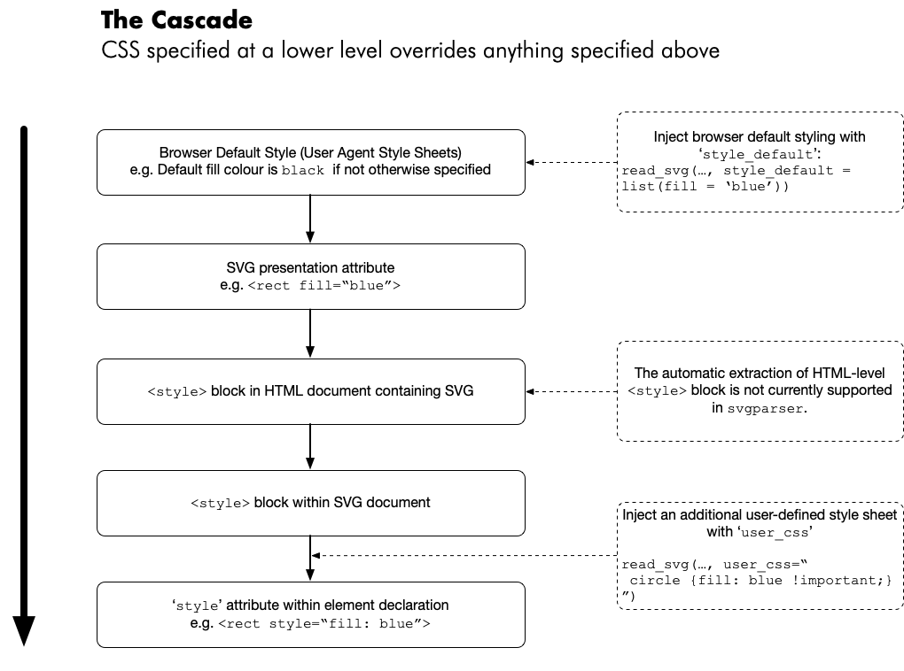

```{r, include = FALSE}
knitr::opts_chunk$set(
  collapse = TRUE,
  comment = "#>",
  fig.height = 5, 
  fig.width = 5
)

#~~~~~~~~~~~~~~~~~~~~~~~~~~~~~~~~~~~~~~~~~~~~~~~~~~~~~~~~~~~~~~~~~~~~~~~~~~~~~
# Ensure that images are rendered using a device which understands patterns
#~~~~~~~~~~~~~~~~~~~~~~~~~~~~~~~~~~~~~~~~~~~~~~~~~~~~~~~~~~~~~~~~~~~~~~~~~~~~~
knitr::opts_chunk$set(dev.args = list(png = list(type = "cairo")))
```

```{r setup}
library(svgparser)
```

# Introduction

Style in SVG is a little more complicated than CSS in a vanilla HTML document.

Consider an SVG image embedded in an HTML document.  The style for a particular 
SVG element is influenced by:

0. The browser default styling (also known as User Agent Styling)
1. The `<style>` block in the HTML document (including any referenced CSS file)
2. The `<style>` block in the SVG document
3. The inline `style = ...` attribute on the element
4. Presentation attributes on the SVG element e.g. `<rect fill='red' ...>`

# The style cascade in SVG

The image below shows the process of style cascade for an SVG image and how 
it is handled within `svgparser`.




# Example SVG


```{r}
svg_text <- '
<svg viewBox="0 0 200 100">
  <rect x="20" y="20" width="30" height="30" style="fill: blue" class="stroked" id = "rect1"/>
  <circle cx="50" cy="50" r="20" class="stroked"/>
</svg>
'
```


```{r}
svg <- svgparser::read_svg(svg_text)

grid::grid.newpage()
grid::grid.draw(svg)
```

# Injecting custom default styling

The SVG specification suggests that by default shapes are filled with black.

The default style specification can be overridded in `svgparser` using the 
`style_default` argument.  This takes a named list of values which will
override the initial style.

Note that in this example, the new default fill colour is only applied to the 
circle as this shape did not define any particular fill colour and hence derives
its value from the default style.

```{r}
svg <- svgparser::read_svg(svg_text, style_default = list(fill = 'skyblue'))

grid::grid.newpage()
grid::grid.draw(svg)
```


# Injecting a supplemental style sheet

A user supplied style can be inserted into an SVG using the `user_css` argument.

This user-supplied style sheet is inserted into the cascade as if it appeared last out of 
all the `<style>` blocks present in the SVG.

Note that this user-supplied CSS takes part in the usual cascade of styles, and
thus you may need to use `!important` if you really want to override an existing style
which might have higher specificity/priority.


```{r}
my_css = '
#rect1 { 
  fill: green !important; 
}

.stroked {
  stroke: black;
  stroke-width: 3;
}

circle {
  fill: pink;
  fill-opacity: 50%;
}
'


svg <- svgparser::read_svg(svg_text, user_css = my_css)

grid::grid.newpage()
grid::grid.draw(svg)


```


