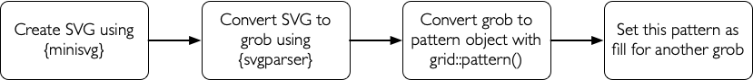

```{r, include = FALSE}
knitr::opts_chunk$set(
  collapse = TRUE,
  comment = "#>"
)

#~~~~~~~~~~~~~~~~~~~~~~~~~~~~~~~~~~~~~~~~~~~~~~~~~~~~~~~~~~~~~~~~~~~~~~~~~~~~~
# Ensure that images are rendered using a device which understands patterns
#~~~~~~~~~~~~~~~~~~~~~~~~~~~~~~~~~~~~~~~~~~~~~~~~~~~~~~~~~~~~~~~~~~~~~~~~~~~~~
knitr::opts_chunk$set(dev.args = list(png = list(type = "cairo")))


#~~~~~~~~~~~~~~~~~~~~~~~~~~~~~~~~~~~~~~~~~~~~~~~~~~~~~~~~~~~~~~~~~~~~~~~~~~~~~
# Only evaluate chunks if R > 4.1.0
#~~~~~~~~~~~~~~~~~~~~~~~~~~~~~~~~~~~~~~~~~~~~~~~~~~~~~~~~~~~~~~~~~~~~~~~~~~~~~
eval_chunks <- getRversion() >= '4.1.0'


```

```{r setup}
library(grid)
library(svgparser)
```


```{r echo = !eval_chunks, eval = FALSE}
# If this Vignette is rendered in R <4.1.0 then the code chunks will
# be displayed but not evaluated
```


## Creating a seamless tileable SVG in R and using it as a fill pattern

With R4.1, `grid` graphics now allows you to set up a repeating tile pattern 
and use it to fill other objects.

If the tile is seamless (i.e. the edges on top/bottom and left/right align perfectly with 
no discontinuities), then a large area may be filled with an interesting pattern.

Using packages such as [{minisvg}](https://github.com/coolbutuseless/minisvg) or 
[{omsvg}](https://github.com/rich-iannone/omsvg) it is possible to easily create an SVG image
wholly within R and use this as a pattern fill for other graphics objects. 

## Overview



## Create SVG using `{minisvg}`

```{r seamless1, comment = "", fig.height = 4, out.width = "20%", eval = eval_chunks}
# remotes::install_github('coolbutuseless/minisvg')
library(minisvg)

# Create SVG document
svg <- minisvg::svg_doc(width = 100, height = 100, fill = '#ECD078')
svg$rect(x = 20, y = 20, width = 60, height = 60, fill = '#542437' , stroke = 'grey70', stroke_width = 10)
svg$rect(x =  5, y =  5, width = 40, height = 40, opacity = 0.8, rx = "20%")
svg$rect(x = 55, y =  5, width = 40, height = 40, opacity = 0.8, rx = "20%")
svg$rect(x =  5, y = 55, width = 40, height = 40, opacity = 0.8, rx = "20%")
svg$rect(x = 55, y = 55, width = 40, height = 40, opacity = 0.8, rx = "20%")

print(svg$as_character())

# Convert SVG document to a grid graphics object i.e. a 'grob'
g <- read_svg(svg$as_character())
grid.newpage(); grid.draw(g)
```

## Create a pattern object

```{r seamless2, comment = "", fig.height = 5, out.width="75%", eval = eval_chunks}
g$vp   <- viewport(width = unit(2, 'cm'), height = unit(2, 'cm'))
pat    <- grid::pattern(g, width = unit(2, 'cm'), height = unit(2, 'cm'), extend = 'repeat')
```

## Use pattern as `fill` for another object

```{r seamless3, comment = "", fig.height = 3, out.width="75%", eval = eval_chunks}
canvas <- circleGrob(r = unit(0.5, 'npc'), gp = gpar(fill = pat))
grid.newpage(); grid.draw(canvas)
```


